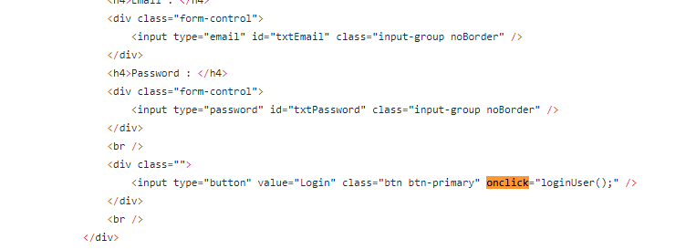
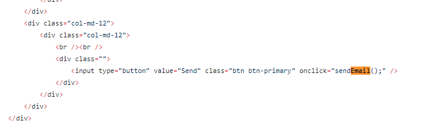
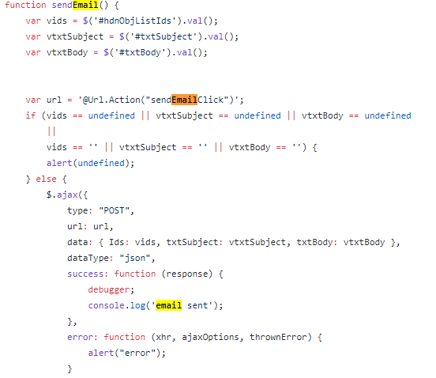
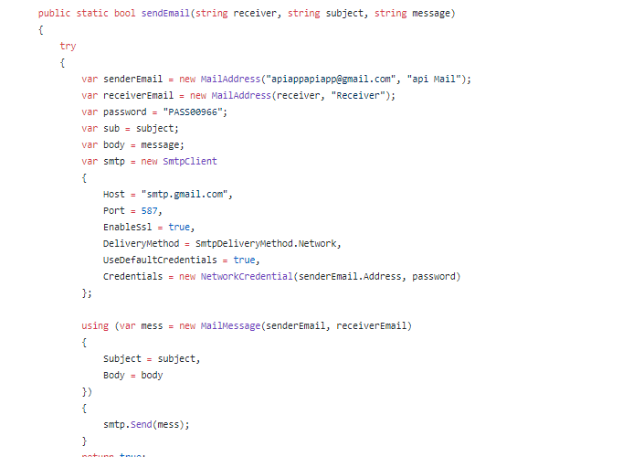
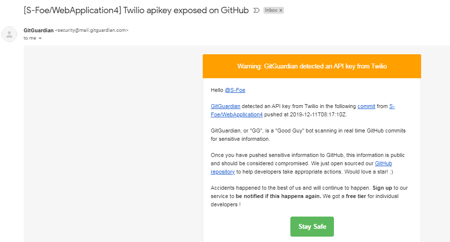

# Client Communicate Portal 

## Description 

This client communication portal can be used in your business for a single unified point to communicate with clients through several third party APIs. 
Communications with clients can be done through Email, SMS, Whatsapp, Telegram ... etc

### How it works ?
This single-page application utlizes JQuery and AJAX functions to update a web page without reloading 
and to send data in the background.

### Function 0:
The $(document ).ready() method will run once the page DOM is ready to execute JavaScript code.
The first JS function call is getUserList();

### Function 1: What does getUserList(); do ?
The function getUserList request JSON data if user is created and on success it calls another function to draw table
in realtime.

### Function 2: How does loginUser()  work ?
If you would go over HTML code you will notice that on click of login button there is a JS function called its name loginUser()
Let's trace how it works

### Function 3: How to send email through third party API? 
On our application, any user who log in would have the option to check a group of people and send email to them. 
Let's see how it works 

On clicking the send email button 

Then, a JS function is run on the background to send AJAX post request 

Each thrid party API will provide you with a guideline to configure both ends. 
On this application I created a gmail account and I am using GMAIL as third party API to send email

# Demo 

Let's see how it looks like 

# Lessons learned 
### - Security Security Security 
 
### - Choose API that is smiple to use 
